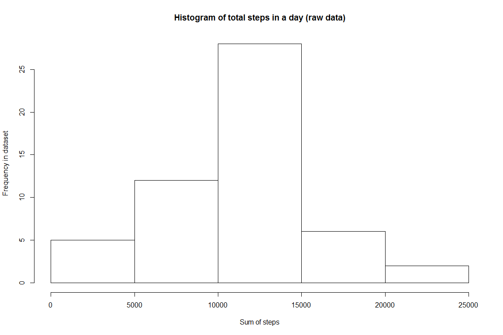
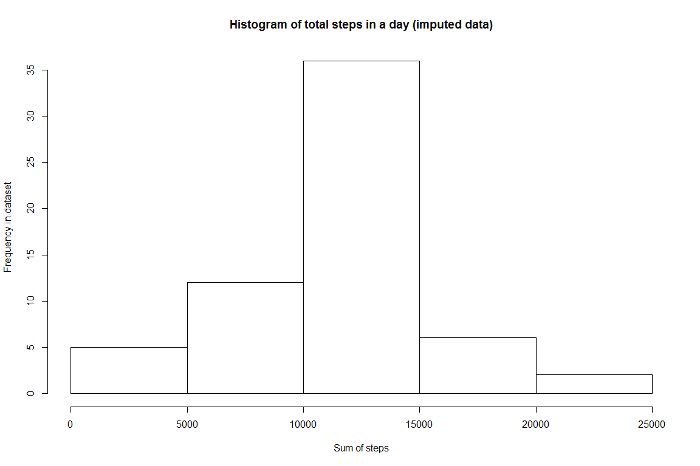
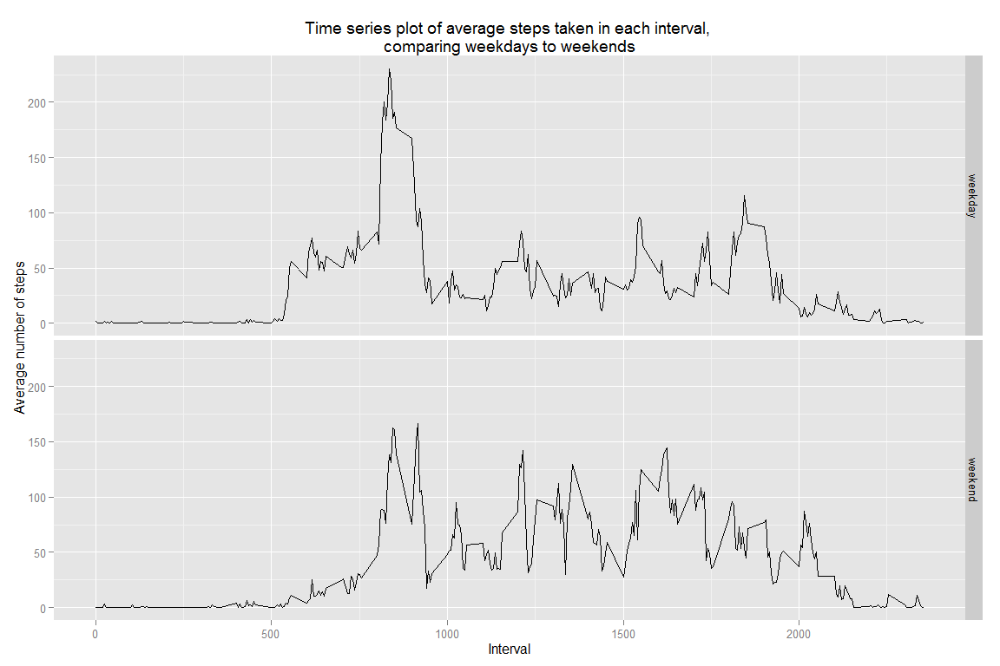

# Reproducible Research: Peer Assessment 1
Damon Grummet  
September 2015  

## Introduction
Welcome to my submission for the first assessment in [Reproducible Research](https://www.coursera.org/course/repdata), September 2015.  

### R markdown Setup

First, some settings and library load commands to set up this document.  Normally this would not be visible in a report.

```r
knitr::opts_chunk$set(fig.width=12, fig.height=8, fig.path='Figs/',
                      echo = TRUE, results = "show")
```

```r
#Load required packages - normally this would be hidden using echo = FALSE, include = FALSE.
library(broman)
```

```
## Warning: package 'broman' was built under R version 3.2.2
```

```r
library(dplyr)
```

```
## 
## Attaching package: 'dplyr'
## 
## The following object is masked from 'package:stats':
## 
##     filter
## 
## The following objects are masked from 'package:base':
## 
##     intersect, setdiff, setequal, union
```

```r
library(ggplot2)
```

```
## Warning: package 'ggplot2' was built under R version 3.2.1
```

```r
library(knitr)
```

## Abstract
(Quoted from the README.md file provided as part of the assignment.)

"It is now possible to collect a large amount of data about personal
movement using activity monitoring devices such as a
[Fitbit](http://www.fitbit.com), [Nike
Fuelband](http://www.nike.com/us/en_us/c/nikeplus-fuelband), or
[Jawbone Up](https://jawbone.com/up). These type of devices are part of
the "quantified self" movement -- a group of enthusiasts who take
measurements about themselves regularly to improve their health, to
find patterns in their behavior, or because they are tech geeks. But
these data remain under-utilized both because the raw data are hard to
obtain and there is a lack of statistical methods and software for
processing and interpreting the data.

This assignment makes use of data from a personal activity monitoring
device. This device collects data at 5 minute intervals through out the
day. The data consists of two months of data from an anonymous
individual collected during the months of October and November, 2012
and include the number of steps taken in 5 minute intervals each day."


## Loading and preprocessing the data

The data has been provided for this project in a zipped archive called 'activity.zip' in the working 
folder.  

The dataset consists of 17,568 observations of 3 variables:
* **steps**: The number of steps taken during the interval, missing values recorded as NA.
* **date**: The date the measurement was recorded, in YYYY-MM-DD format.
* **interval**: A time tag in hhmm format (no leading zeros) indicating the specific 5 minute interval

The file 'activity.csv' within the archive is in comma separated values format (csv.)

To import this data, it needs to be unzipped and read by the csv reader package:


```r
# read raw data from zipped file
rawactivitydata <- read.csv(unzip('activity.zip'))
```

No data cleansing will be done at this stage, as later questions in this project compare the uncleansed results below with imputed data.  Hence, there are a number of NA values present in the 'steps' column, as can be seen in the summary:

```r
summary(rawactivitydata)
```

```
##      steps                date          interval     
##  Min.   :  0.00   2012-10-01:  288   Min.   :   0.0  
##  1st Qu.:  0.00   2012-10-02:  288   1st Qu.: 588.8  
##  Median :  0.00   2012-10-03:  288   Median :1177.5  
##  Mean   : 37.38   2012-10-04:  288   Mean   :1177.5  
##  3rd Qu.: 12.00   2012-10-05:  288   3rd Qu.:1766.2  
##  Max.   :806.00   2012-10-06:  288   Max.   :2355.0  
##  NA's   :2304     (Other)   :15840
```

# The Questions

The assignment has been broken up into a set of questions to be answered.  The questions and my attempts to provide answers follow.

## What is mean total number of steps taken per day?

```r
totalstepsperday <- aggregate(rawactivitydata$steps, list(rawactivitydata$date), sum)
colnames(totalstepsperday) <- c('Date','Sum')
hist(totalstepsperday$Sum, main = "Histogram of total steps in a day (raw data)",
     xlab = "Sum of steps", ylab = "Frequency in dataset")
```

 

```r
medianStepsPerDay <- as.numeric(median(totalstepsperday$Sum, na.rm=TRUE))
medianStepsPerDay
```

```
## [1] 10765
```

```r
meanStepsPerDay <- as.numeric(mean(totalstepsperday$Sum, na.rm=TRUE))
meanStepsPerDay
```

```
## [1] 10766.19
```

In the raw data, the median number of steps per day is 10765.

The average (mean) total steps in a day is 10766.19.


## What is the average daily activity pattern?

```r
# average daily activity pattern. group by interval, show a representative day.
repDay <- rawactivitydata %>%
  group_by (interval) %>%
  summarize( meanSteps = mean(steps, na.rm=TRUE))

#average daily activity
plot(repDay$interval, repDay$meanSteps, type="l", main = "Time Series of an 'average' day", xlab="Time of Day", ylab="Average Steps")
```

 
(please note, the time intervals are displayed in a pseudo military time format {hhmm} where leading zeros are missing.)

There is a marked peak in the morning, with regular activity during the daylight hours.  Activity reduces in the evening and predictably reaches a minimum in the later parts of the night.


```r
#find the interval where the maximum number of average steps occurs:
mostactiveinterval <- as.numeric(repDay[which.max(repDay$meanSteps),1]$interval)
mostactiveinterval
```

```
## [1] 835
```

The most active period in the average day is 835, reaching around 206.17 steps per day.


## Imputing missing values

```r
countmissingsteps <- sum(is.na(rawactivitydata$steps))
countmissingsteps
```

```
## [1] 2304
```

The raw data contains 2304 rows where the steps value is NA.

The following code uses the representative day table (repDay) generated above, to fill in the missing values in the raw data.  This is a very rough way to impute missing data to produce a working dataset for further analysis.  Where there is a missing value, the average value for that interval will be inserted.


```r
#create a table with the meanSteps from the representative day appended to the raw data,
# making use of vector recycling for the shorter repDay vector
tempdata <- cbind(rawactivitydata,repDay$meanSteps)

# now generate imputed data using replacement - if the steps value is NA, use the meanSteps
# for the day as previously worked out.
imputed <- tempdata %>%
  mutate(steps = ifelse(is.na(steps), floor(repDay$meanSteps),steps)) %>%
  select(steps,date,interval)

#however mean of total steps per day is: get total steps per day, then find mean:
imputedtotalstepsperday <- aggregate(imputed$steps, list(imputed$date), sum)
colnames(imputedtotalstepsperday) <- c('Date','Sum')
```

Now that the missing data has been replaced with approximations based on available data, we can generate a histogram to see how the data frequency now looks:

```r
# histogram of steps, mean and median values.
hist(imputedtotalstepsperday$Sum, main = "Histogram of total steps in a day (imputed data)",
     xlab = "Sum of steps", ylab = "Frequency in dataset")
```

 

As can be seen, the histogram on the imputed data looks very close to the original histogram of the raw data.

The mean and median can now be computed to test the variance of the imputed data from the raw data.

```r
imputedmedianStepsPerDay <- median(imputedtotalstepsperday$Sum)
imputedmedianStepsPerDay
```

```
## [1] 10641
```

```r
imputedmeanStepsPerDay <- mean(imputedtotalstepsperday$Sum)
imputedmeanStepsPerDay
```

```
## [1] 10749.77
```

The median for the imputed data set is 10641.0 and the mean is 10749.7705.  

The method used here for imputing the missing data has resulted in a slight skewing of the data, as can be seen in the following comparison:

```r
#note, the "asis" option is needed to make the kable output display in a pretty format

comparedata<- data.frame(datasource=c('Raw','Imputed'), 
                         mean = c(meanStepsPerDay,imputedmeanStepsPerDay), 
                         median = c(medianStepsPerDay,imputedmedianStepsPerDay))
xt <- kable(comparedata, format="markdown")
print(xt, "html", include.rownames = FALSE)
```


|datasource |     mean| median|
|:----------|--------:|------:|
|Raw        | 10766.19|  10765|
|Imputed    | 10749.77|  10641|

The median value in particular has dropped, though only by 1.2%.  Given such small differences, we can assume for the purposes of this exercise that the imputed data is a very good estimate of the truth.


## Are there differences in activity patterns between weekdays and weekends?

Firstly, we need to factorise the imputed data into two groups - weekdays and weekends.  Using the function 'weekdays()' in a dplyr mutate cascade construct, then grouping by the factor and interval will allow generation of a table of the mean steps per interval for weekdays and weekends.

```r
# add weekday flag, group and summarize the mean
imputedwkday <- imputed %>%
  mutate(weekdayfactor = ifelse(((weekdays(as.Date(date, format="%Y-%m-%d"))=="Saturday")|
                               (weekdays(as.Date(date, format="%Y-%m-%d"))=="Sunday")),
                            'weekend','weekday')) %>%
  group_by (weekdayfactor,interval) %>%
  summarize( meanSteps = mean(steps))
```

Now, the result can be plotted:


```r
weekvsweekend <- qplot(interval, meanSteps, data=imputedwkday, 
                       facets = weekdayfactor ~ ., geom = c('line'),
                       main = "Time series plot of average steps taken in each interval, 
comparing weekdays to weekends",
                       xlab = "Interval",
                       ylab = "Average number of steps")
print(weekvsweekend)
```

 

This graph suggests there is a difference in walking behaviour between weekdays and weekends. Weekdays are showing greatest walking activity in the morning around 8:30am, whereas the weekends have walking spread out more evenly during the day.  

## Conclusion

As can be seen from the results above, there appears to be a level of repetition in the subjects daily routine, more prevalent during weekdays but still noticable on weekends.  The greatest consistent activity appears to occur in the morning, with the maximum pace achieved around 8:35am daily.  It can be surmised that the bus to work tends to get the drop on the subject more often than would be appreciated. Furthermore, given the frequency of spikes of movement, and the general consistent above zero stepcount during the day, the subject can be inferred to be engaged in an occupation that requires consistent low intensity walking, such as would be common in the role of school teacher, lecturer, shop attendant, chef or footwear quality assurer.  
